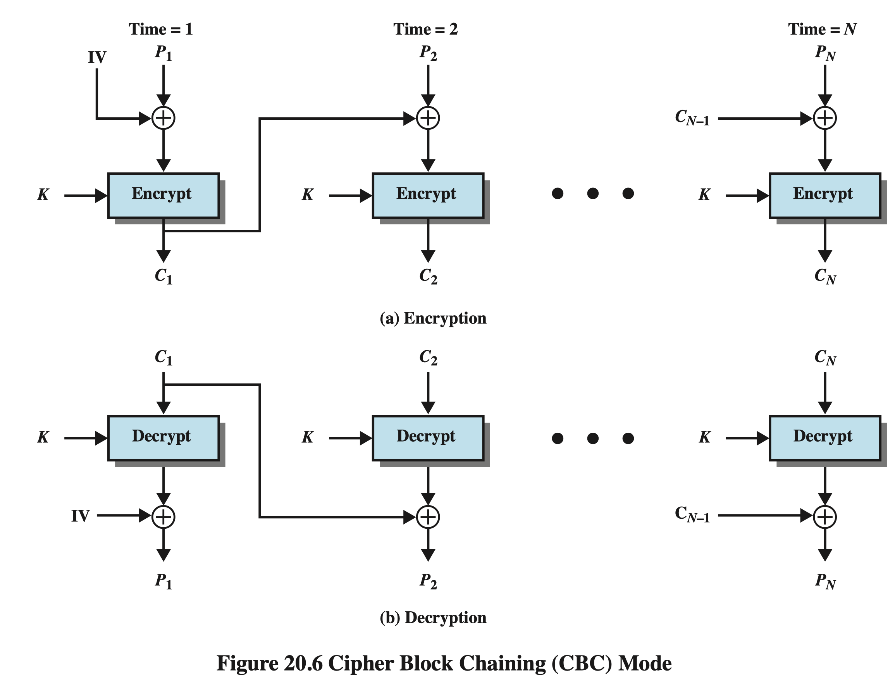
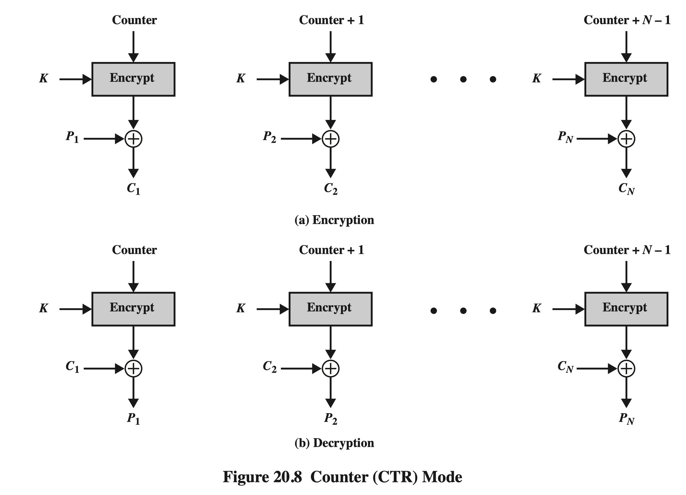

## Getting Started

Modify or add a new line in the input.csv with format "Key, PlainText", and run the code.

The result of SDES will be saved in the file: output.csv.

## Code Structure
### encryption implements
- App.java: do encryption, if want to call BruteForce.java, uncomment all the lines after line: Brute Force
- BruteForce.java: do BruteForce if have plaintext and opposite ciphertext (with or without hint).
- CsvDataEncrypt.java: read input.csv, call function SDES.java and write results to output.csv
- SDES.java: call functions Key generation and Encryption
- Encryption.java: mainly SDES encrypt process, using Feistel structure, do double F function, Switch, initial permutation and final permutation
    - FFunction.java: implement f function, include S-box function and do XOR operation to result of F function
### Key generation implements
- KeyGeneration: generate subkeys from orginal key.
    - Key.java: class Key
### other tools:
- utils.java: include some tools: convert between String and array, concat arrays, XOR operation, Decimal to Binary
- Permutation.java: do all permutate operation in SDES exclude S-Box operate

### 2021-3-6: add CBC and CTR mode
- CBC.java: 
- CTR.java: 